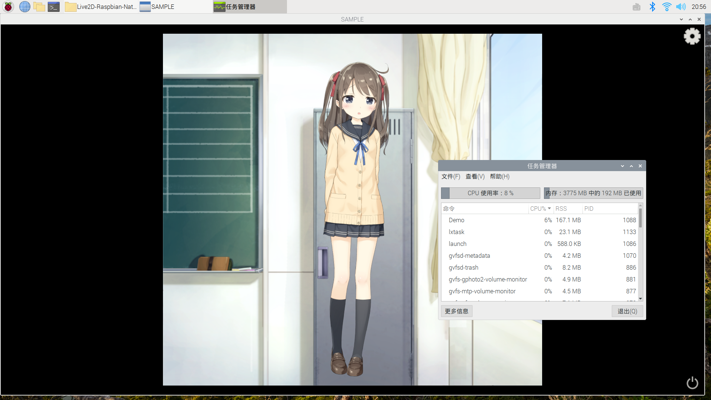

# Live2D-Raspbian-Native-Sample


Live2D Sample Raspbian (or Linux arm) Native with OpenGL 

From official repo https://github.com/Live2D/CubismNativeSamples


## Environment

| OS                | Raspbian 10 buster 32 bit |
| ----------------- | --------------------- |
| **Packages**      | **Version**           |
| CMake             | > 3.15                |
| Cubism SDK Native | 2.1 (Beta)            |
| GLEW              | 2.1.0                 |
| GLFW              | 3.3                   |


## Performance



| Programs                           | CPU (single core?) | FPS         |
| ---------------------------------- | --------------------- | ------------ |
| Glava                              | 29.3%                 | 20.6 MiB     |
| **Live 2D Native OpenGL** | **6% ± 2%**             | > 60 normal |
| Cocos Creator h5 + [unoffical plugin](https://github.com/playnb/Live2dForCocosCreator)      | full                | 50±2 normal ，> 60 overclock 2Ghz/800Mhz     |
| Unity Html5 + offical plugin        | full                |  50±4 overclock 2Ghz/800Mhz     |


## Setup, and Run

```bash
# download and setup all libraries (Will not install to system)
# compile the code after finished setup
./setupSDK

# Run the example
./launch

# Compile the code (For develop)
./build
```

